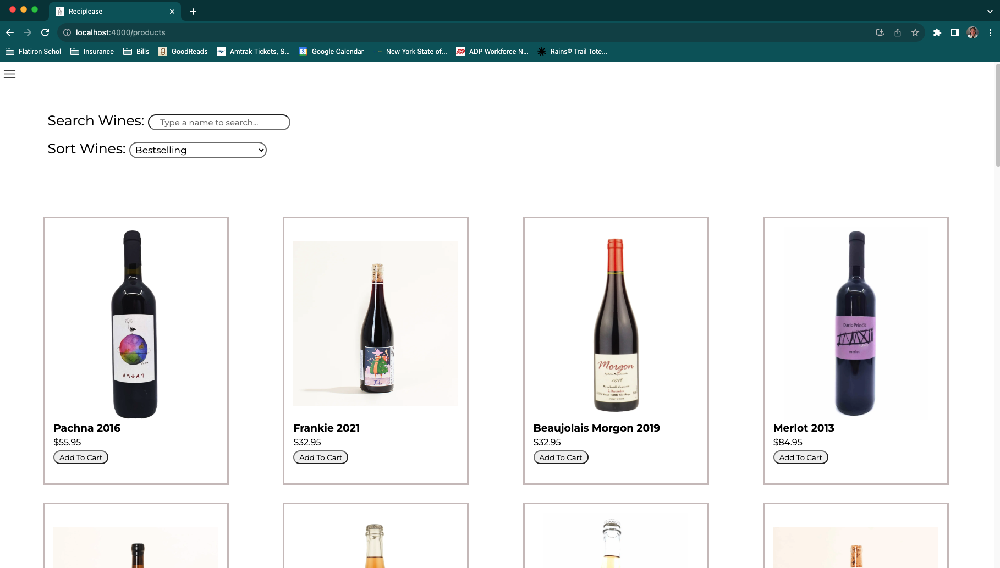

# A Natural Wine Ecommerce Site

## Built With
This application was built with React.js, Python, Flask, and SQLAlchemy.

***

## Getting Started

### Run client (terminal 1): 
• cd into 'client'

• run npm install & npm start

### Run server (terminal 2): 
• run pipenv install and pipenv shell

• cd into 'server'

• run python app.py

***

## Contact
Project Team: Sarah Jones & Peter Yelton

Sarah Jones - sarahrjones8@gmail.com - https://www.linkedin.com/in/srjones02/

Project Link: https://github.com/sarahjones016/phase-5-project-revised
